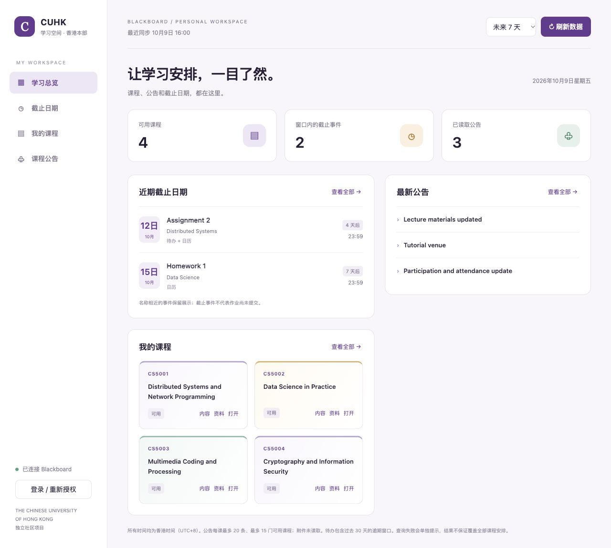

# CUHK Blackboard Dashboard

香港中文大学（香港本部）的本地 Blackboard 学习 Dashboard，基于 [zs-andy/lms-cli](https://github.com/zs-andy/lms-cli) 开发。

将课程、公告、作业截止日期和日历集中展示，提供图形界面、CLI 和 MCP。学校平台操作为只读，登录与验证由用户在学校页面完成。



> 预览图使用虚构测试数据；运行后读取你自己的 Blackboard 账号。此项目为独立社区项目，与 CUHK、Blackboard 及上游开发者无官方合作关系。

## 功能

- **总览**：可用课程、截止事件、最新公告与连接状态。
- **DDL总览**：合并待办和日历，保留来源，统一显示香港时间。
- **我的课程**：课程搜索、课程内容与资料列表、打开 Blackboard 页面。
- **课程公告**：搜索标题、课程和正文，展开阅读并查看原始来源。
- **登录与刷新**：复用本机授权，支持重新登录及未来 7、14、30 天查询窗口。
- **CLI / MCP**：沿用上游的结构化查询、AI 助手接入和本地待办功能。

## 在 macOS 上运行

需要 Git、npm 和 **Node.js 24 LTS**。当前图形界面启动入口面向 macOS；Windows/Linux 图形启动尚未适配和实测。

```sh
git clone https://github.com/tayang-cc/CUHK-Blackboard-Dashboard.git
cd CUHK-Blackboard-Dashboard
npm ci
node node_modules/electron/install.js
npm run build
chmod +x cuhk *.command
./Open-CUHK.command
```

安装完成后，也可以在 Finder 中双击 `Open-CUHK.command`。首次进入请点击「登录 / 重新授权」，在 CUHK 页面完成登录；已有有效授权时自动复用。查询可能需要十几秒。

命令行方式：

```sh
./cuhk                          # 配置、登录并检查连接
./cuhk --profile cuhk overview --days 7 --fresh
./cuhk --profile cuhk blackboard courses
./cuhk mcp                     # 启动 MCP 服务
```

完整操作说明见 [README-CUHK.md](README-CUHK.md)。本仓库提供源码，尚未发布此 Dashboard 的独立安装包。

## 数据与查询范围

配置、加密授权与浏览器会话位于本项目 `.cuhk-data/`，加密密钥由操作系统凭据库管理。该目录被 Git 忽略；复制或分享整个文件夹时仍应排除它。不要上传账号密码、Cookie、私有课程数据或本机配置。下载资料为普通文件。

公告查询每课最多 20 条、最多 15 门可用课程，概览不读取附件；待办包含过去 30 天的逾期窗口。待办与日历覆盖可能不同，因此界面合并两者；仅去重同课程、同标题和同时间的事件。截止事件不代表作业尚未提交。

连接器依赖 Blackboard Learn Ultra 内部接口，平台更新或课程差异可能影响功能。CLI 的课程、公告、待办与日历已由用户实测成功；图形界面使用虚构数据完成交互验证，真实图形界面与资料读取仍需验证。详见 [验证记录](CUHK-VALIDATION.md)。

## 开发

```sh
npm run typecheck
npm test
```

核心界面位于 `src/dashboard/`，复用上游的授权和查询后端。CLI 与桌面界面共用学校配置和本机授权。

## 来源与许可

基于 lms-cli 0.4.7（上游 commit `cdbbba4270a6e036b53afd52fae4f118782bce4c`）适配，保留上游历史、MIT 许可和第三方声明。上游提供多学校 CLI/MCP、加密授权和固定版本 Canvas/Blackboard 连接器。本项目新增 CUHK 香港本部预设、学校搜索名称、本地启动入口及学习 Dashboard，并更新 MCP SDK。

- [MIT License](LICENSE)
- [第三方组件说明](THIRD_PARTY_NOTICES.md)
- [隐私说明](PRIVACY.md)
- [上游开发文档](docs/DEVELOPMENT.md)
